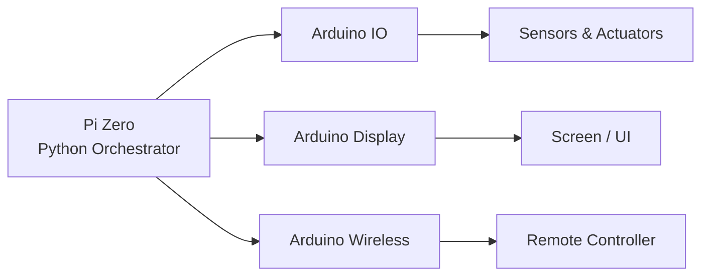

  

    

  <b>Raspberry Pi controller with Arduino subsystems</b>

---

## 🛸 Overview

A multi-module controller system using a Raspberry Pi Zero as the central orchestrator, with Arduino nodes handling IO, display, and wireless communication.

---

## 🛠️ Architecture

---

## 📁 Modules

| Module | Platform | Role |
|--------|----------|------|
| Pi-Zero | Python | Main controller logic |
| IO | Arduino | Sensor reading & actuation |
| Display | Arduino | Screen output |
| Wireless | Arduino | Remote communication |

---

## 🚀 Tech Stack

   

---

  

